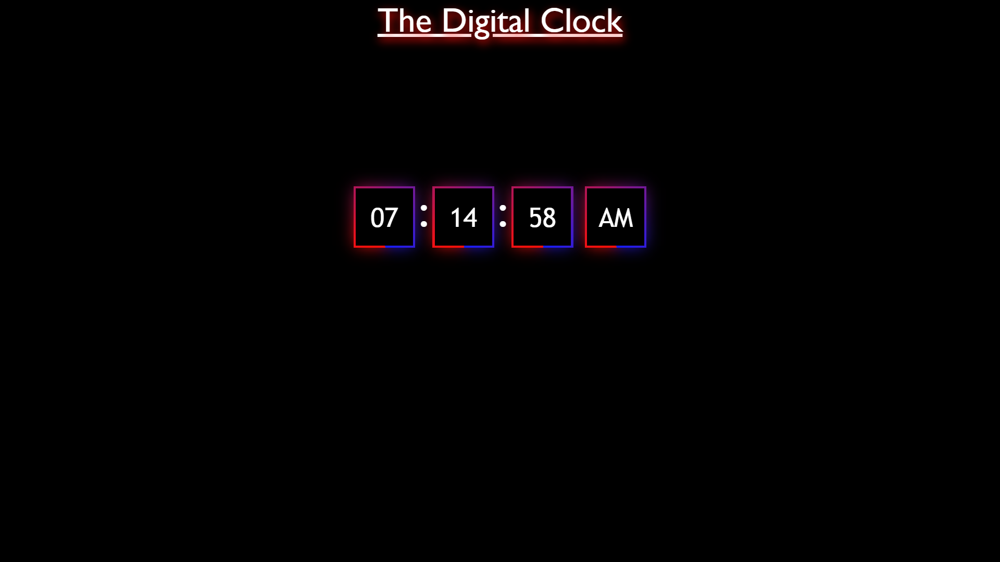

# Digital Clock

A **React.js** project that displays the current time in a 12-hour format with AM/PM. The clock updates dynamically every second and is styled with CSS for a modern look.

---

## Key Learnings

- Using **React Hooks**: `useState` for managing time and `useEffect` for side effects.
- Formatting time using the **JavaScript Date Object**.
- Styling with CSS for clean, responsive design.
- Time logic: 12-hour format conversion and AM/PM indication.

---

## How to Run

1. Clone the repository:
   ```bash
   git clone <repository_url>
   ```
2. Install dependencies:
   ```bash
   npm install
   ```
3. Start the app:
   ```bash
   npm run dev
   ```

---

## Future Enhancements

- Add a 24-hour format toggle.
- Display the current date alongside the clock.

---

## Preview


